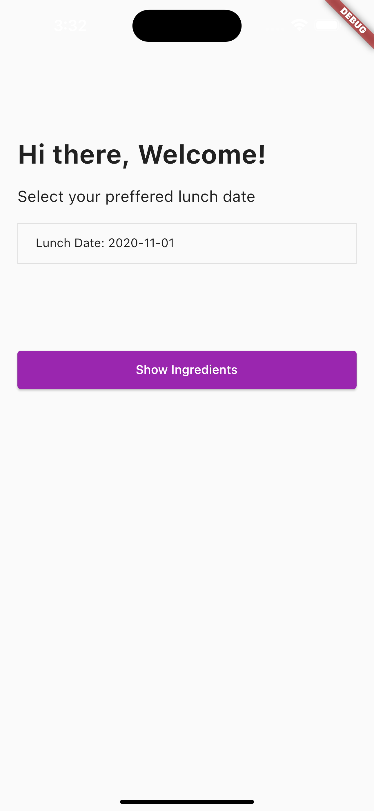
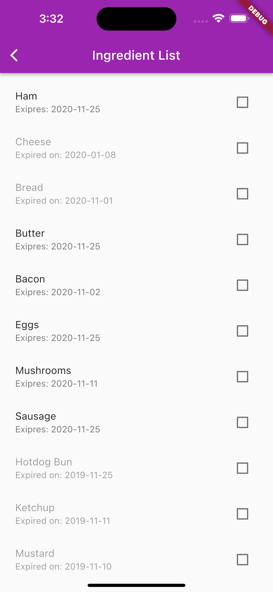
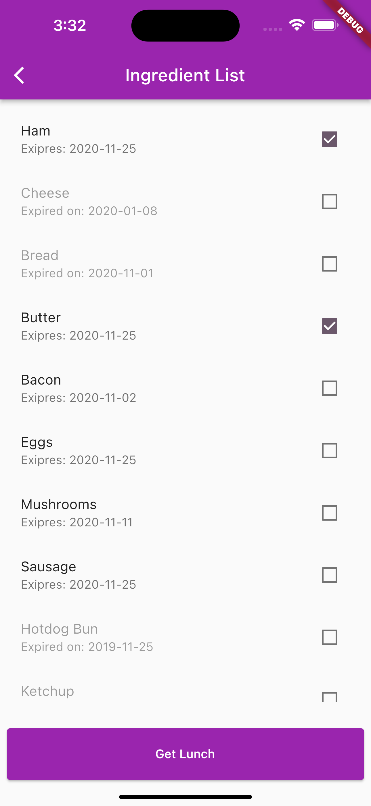
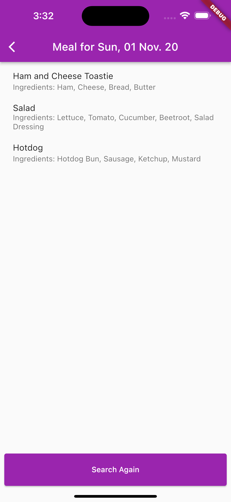

# Apps for Lunch Recipes Suggestion

##  How to use

#### Test the app
```dart
flutter packages get
flutter test --coverage
```

#### Start the app

```dart
flutter packages get
flutter run
```
####  Build the app

```dart
// Android
flutter build apk -- or -- flutter build appbundle

// iOS
flutter build ios
```


### Libraries
| Purpose | Plugin |
| ------ | ------ |
| State Management | [flutter_bloc](https://pub.dev/packages/flutter_bloc)|
| Dependency Injection | [get_it](https://pub.dev/packages/get_it)|
| Equality Comparisons | [equatable](https://pub.dev/packages/equatable) |
| Network API Call | [http](https://pub.dev/packages/http) |
| To return Multiple Objects | [dartz](https://pub.dev/packages/dartz) |
| Test packages | [bloc_test](https://pub.dev/packages/bloc_test)  [mockito](https://pub.dev/packages/mockito)  [mocktail](https://pub.dev/packages/mocktail)|

### Screen Capture

 
 


